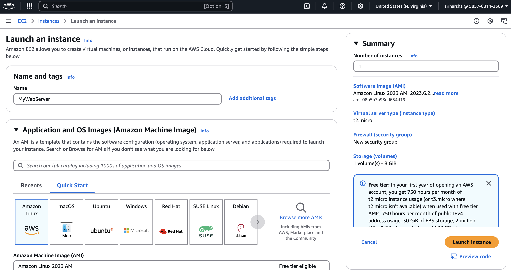

# EC2-based Web Server Setup (Apache)

In this project, we will deploy a web server using Amazon EC2 instance, install Apache and configure it to serve a basic website.

## Project Overview

**Name:** MyWebServer  
**Services:** Amazon EC2, Apache  
**Purpose:** Deploy a basic website on an EC2 instance

## Prerequisites

- An AWS account with access to EC2
- A key pair (.pem file) for SSH access
- Basic knowledge of the AWS Console and using a terminal/SSH

## Steps to Set Up an EC2-based Web Server

### 1. Launch an EC2 Instance

1. Log in to the AWS Management Console.
2. Navigate to **EC2 → Instances → Launch Instances**.
3. Configure your instance:
   - **Name:** MyWebServer
   - **AMI:** Amazon Linux 2
   - **Instance Type:** t2.micro (Free Tier eligible)
   - **Key Pair:** Select an existing key pair or create a new one
   - **Security Group:** Allow SSH (port 22) and HTTP (port 80)
4. Click **Launch**.

### 📸 Screenshot: *EC2 Launch Config*


### 📸 Screenshot: *AMI Instance Type*


### 📸 Screenshot: *Key Pair and Security Group*


### 📸 Screenshot: *EC2 Instance*


### 2. Connect to the EC2 Instance

Open your terminal and run the following (replace `<your-key.pem>` and `<your-instance-public-ip>` accordingly):

```bash
ssh -i <your-key.pem> ec2-user@<your-instance-public-ip>
```

### 📸 Screenshot: *SSH Connection*


### 3. Install Apache
Update the package repository:

```bash
sudo yum update -y
```

Install Apache:
sudo yum install httpd -y

Start & enable Apache:

```bash
sudo systemctl start httpd
sudo systemctl enable httpd
```

Verify installation:

```bash
sudo systemctl status httpd
```

### 📸 Screenshot: *Apache Service Status*


### 4. Deploy a Web Page

Create a simple index.html file:

```bash
sudo echo "<h1>Welcome to My Web Server</h1>" > /var/www/html/index.html
```

### 📸 Screenshot: *Deployed Web Page*


### 5. Access the Web Server
Open a browser and navigate to:

```bash
http://<your-instance-public-ip>
```

You should see:

Welcome to My Web Server

### 📸 Screenshot: *Final Web Page*


File Structure

``` bash
.
├── README.md             # This documentation
├── commands.sh           # Shell script with all essential commands
└── screenshots/
    ├── ec2_launch.png
    └── web_server.png
```

